# Краткий пример работы

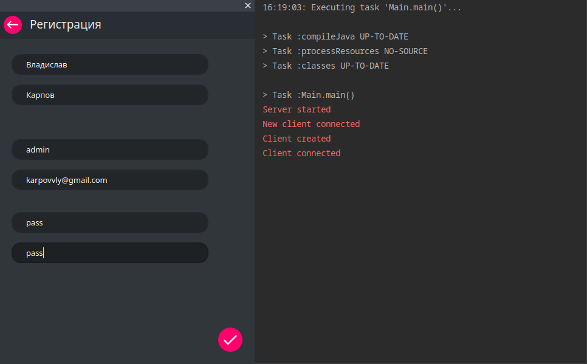
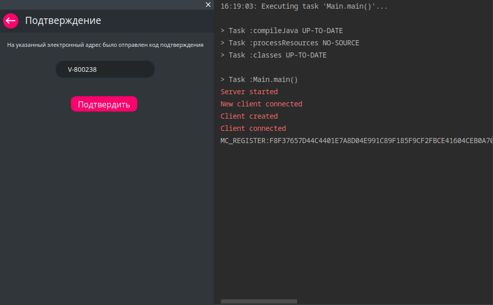
#### Подтверждение регистрации
.jpg)

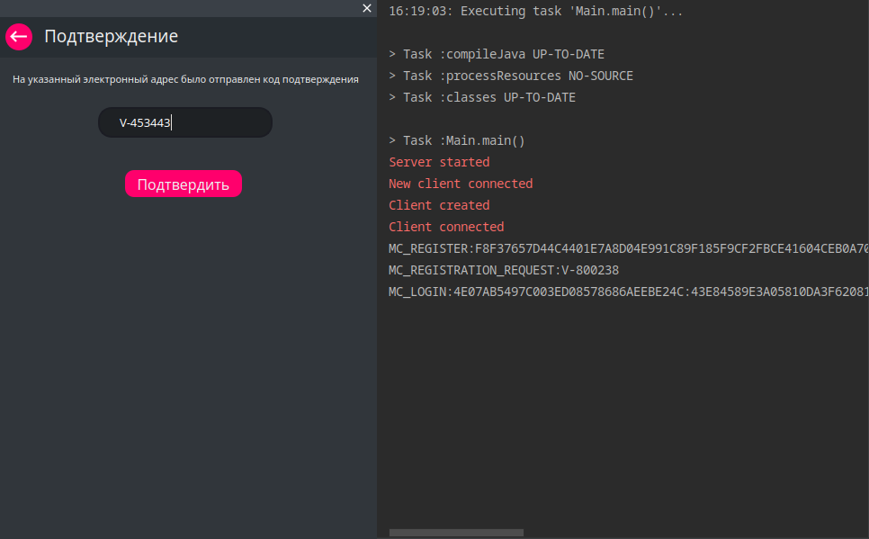
#### Подтверждение входа
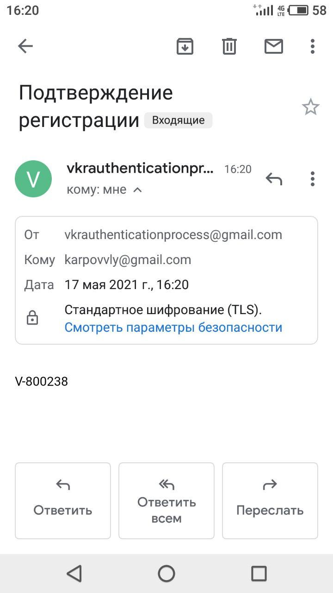
### Главное окно приложение
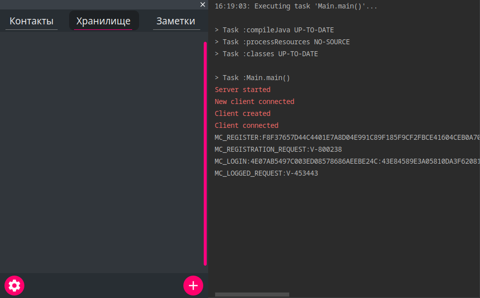
### На примере заметок
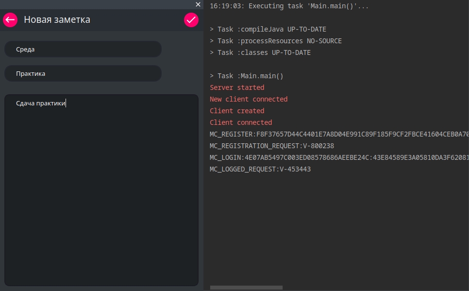
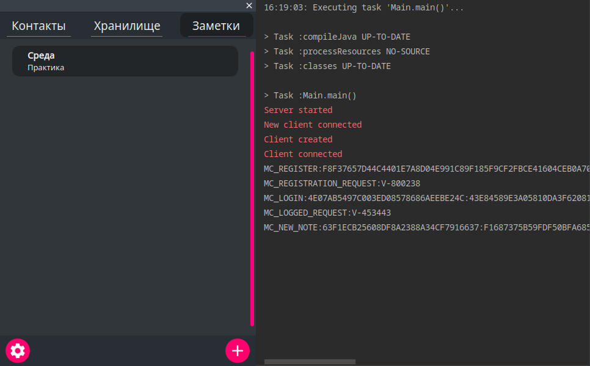
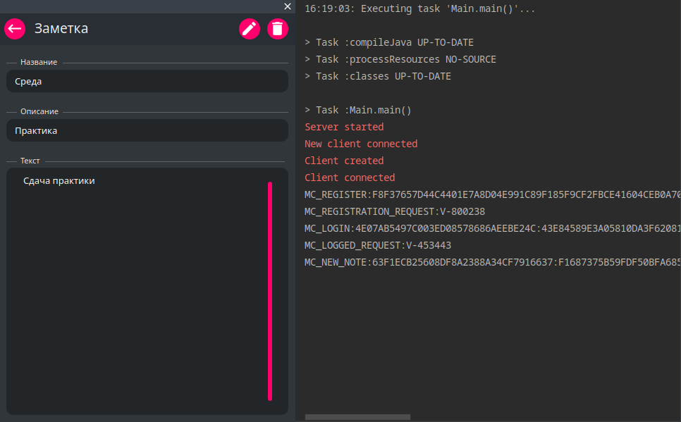

### БД сервера
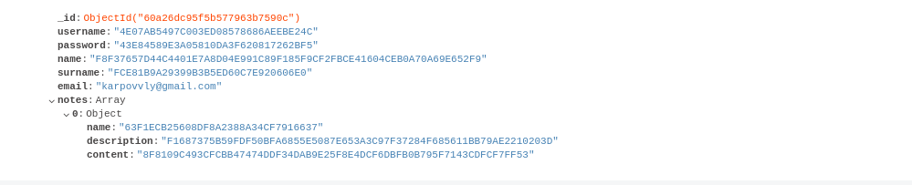
### БД клиента
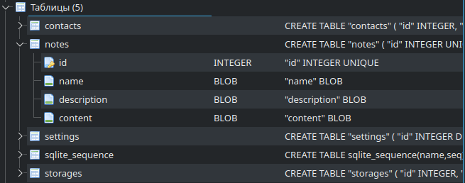
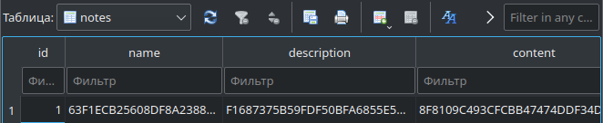

### Пример живого использования
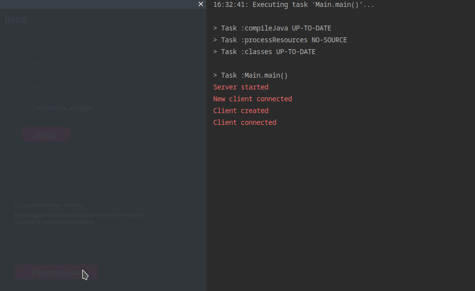
